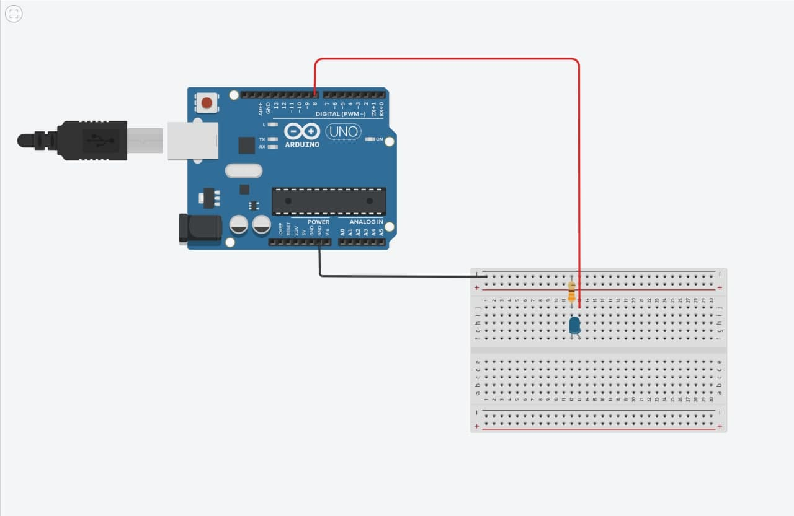

# Arduino Voice Control 

I was in my free time, waiting for a bug to be solved in another project. So, something came to my mind! What if ... we could control our electronics with our voices? 

So I decided to make it happen. This is a very simple form of the project, but effective. What it does is just sending some data through a serial connection to an arduino board, and in the micro-controller side of the project, we make something happen. In this case, I used a single LED. 

## The Circuit

### Schematics 



### Parts

1. Arduino (I used Uno, but as long as you can have a proper serial connection, the model doesn't matter)
2. LED 
3. Resistor (For most of applications, and most of boards 220 or 330 ohms is okay. But if you have a weaker model of the board that does not have a 5+ volts logic, 100 ohms is a choice.)

### Arduino code

As the arduino code was not that complicated, I put it here: 

```c++

#define LED 8

void setup(){
    pinMode(LED, OUTPUT);
    Serial.begin(9600);
}

void loop(){
    String input_string = Serial.readString(); 
    if(Serial.available()){
        if(input_text == "on\n"){
            digitalWrite(LED, HIGH);
        }
        if(input_text == "off\n"){
            digitalWrite(LED, LOW);
        }
    }
}
``` 

__NOTE__ : It is important for commands to include `\n`. Without that, it's not working. 

## Important notes 

The python script has been written and tested with Python 3.8, and it was fine. For older or newer versions there must be no problems either. Also you need to install `pyserial` library in order to get this thing to the work. Otherwise it won't be functioning. 

In this line:

```python
target = serial.Serial('/dev/cu.usbmodem142101', 9600)
```

The `/dev/cu.usbemodemXXXXXX` is refering to the _serial port_ I used. This format for external serial connections is used on _Darwin_ operating system (the heart of Apple's macOS). If you have windows, it'll look like `COMX`. On Linux, it's `/dev/ttyUSBX`. 

In order to find what port is the right one, you may use Arduino IDE. Please mind that on Linux, you might need to use `sudo` for executing the code. 